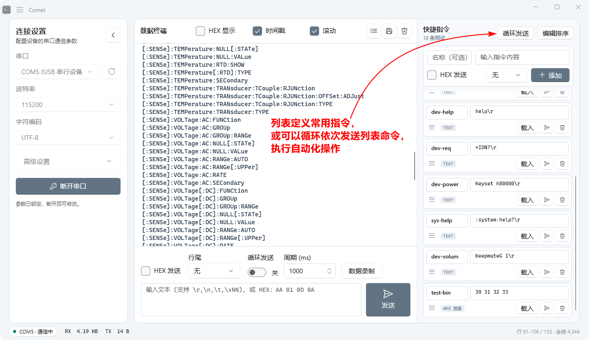

# Comet

<p align="center">
  
</p>

Comet 是基于 WinUI 3 与 .NET 10 开发的 Windows 桌面串口调试工具。它不绑定特定开发板、芯片或通信协议，适用于开发板终端、串口模块、传感器和其他通用串行设备。

<p align="center">
  <a href="docs/USER_GUIDE.md">使用指南</a> ·
  <a href="docs/ENVIRONMENT.md">构建与发布</a> ·
  <a href="docs/ARCHITECTURE.md">软件架构</a> ·
  <a href="docs/TESTING.md">测试指南</a>
</p>



## 功能概览

| 模块    | 当前能力                                          |
| ----- | --------------------------------------------- |
| 串口连接  | COM 端口枚举、Windows 设备名称、完整通信参数、DTR/RTS 和同端口自动恢复 |
| 数据发送  | 文本转义、HEX、内容区键入、底部循环发送和快捷指令列表循环                |
| 数据接收  | UTF-8、GBK、ASCII 流式解码，文本/HEX 双视图和原始 RX 录制      |
| 终端显示  | 时间戳、RX/TX/SYS 前缀、软折行、自动滚动、跨行选择和复制             |
| 大数据处理 | 后台接收队列、UI 分批处理、完整会话存储、增量行索引和可见行虚拟化            |
| 用户数据  | 设置持久化、最多 60 条快捷指令、JSON 备份和完整格式化日志导出           |

所有发送格式、接收显示、自动恢复和持久化行为都在 [使用指南](docs/USER_GUIDE.md) 中统一定义。

## 快速开始

1. 解压完整便携包，不要单独复制 `Comet.exe`。
2. 启动 `Comet.exe`，刷新并选择串口。
3. 设置波特率、数据位、停止位、校验、流控制等参数。
4. 点击“连接串口”。连接后参数区会锁定，断开后才能修改。
5. 使用底部发送框、终端内容区键入或快捷指令与设备通信。

端口列表会尽量显示 Windows 提供的设备名称，例如 `COM5 (USB-SERIAL CH340)`；实际连接始终使用 `COMx`。默认通信参数和全部操作说明见 [使用指南](docs/USER_GUIDE.md)。

## 设计概览

解决方案由两个纯 C# 产品项目组成：

```text
Comet（WinUI 3）
  App / Views / Controls / Windows Services
                  ↓ 注入抽象接口
Comet.Core（net10.0）
  Models / ViewModels / Transmission / Text / Terminal / Recording
```

- `Comet.Core` 保存不依赖 WinUI 的发送规则、会话模型、服务契约和 ViewModel；`Comet` 提供窗口、控件及 Windows 串口、文件和计时器实现。
- 串口 RX 在进入 UI 队列前分出原始录制支路，录制文件不受文本解码、显示模式或终端清空影响。
- 文本和 HEX 各自保留完整格式化会话；活动终端只为视口附近创建行元素，把历史容量和 UI 元素数量分离。
- 循环发送在后台高分辨率计时器线程写入串口，终端渲染不会反向阻塞调度。
- USB 串口失效后保留用户连接意图，同一 COM 口恢复时使用原参数自动重连；手动断开和窗口关闭会取消恢复。

依赖方向、组件职责和关闭顺序见 [软件架构](docs/ARCHITECTURE.md)，终端索引、虚拟化与选择算法见 [虚拟化终端实现](docs/VIRTUAL_TERMINAL.md)。

## 源码结构

```text
Comet/
├─ src/Comet.Core/       平台无关核心、服务契约和 ViewModel
├─ src/Comet/            WinUI 界面与 Windows 具体服务
├─ tests/Comet.Tests/    核心和 ViewModel 自动化测试
├─ docs/                 使用、架构、开发和测试文档
└─ Comet.sln
```

开发基线为 .NET 10、WinUI 3 和 Windows App SDK；最低系统为 Windows 10 1809，发布目标包括 x86、x64 和 ARM64。项目采用 Unpackaged、自包含、非单文件发布，运行时必须保留完整发布目录。环境安装、构建命令和发布配置见 [构建与发布](docs/ENVIRONMENT.md)。

## 文档

| 文档                                  | 唯一职责                     |
| ----------------------------------- | ------------------------ |
| [使用指南](docs/USER_GUIDE.md)          | 用户可见功能、数据格式、操作语义、本地数据和限制 |
| [软件架构](docs/ARCHITECTURE.md)        | 分层、依赖方向、组件职责、关键数据流和维护不变量 |
| [虚拟化终端实现](docs/VIRTUAL_TERMINAL.md) | 完整会话、行索引、虚拟化、滚动、选择和输入代理  |
| [构建与发布](docs/ENVIRONMENT.md)        | 开发环境、还原、构建、运行、便携发布和常见问题  |
| [测试指南](docs/TESTING.md)             | 自动化范围、设备验收、压力测试和发布验证     |

功能变更应先更新使用指南中的唯一行为定义，再更新对应架构约束和验收项，避免在多个文档中维护相同说明。
