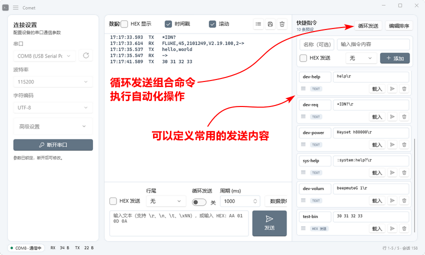

## Comet

<p align="center">
  
</p>

Comet 是基于 WinUI 3 与 .NET 10 开发的桌面串口调试工具。项目不绑定特定开发板、芯片或通信协议，适用于开发板终端、串口模块、传感器和其他通用串行设备。

<p align="center">
  <a href="docs/ENVIRONMENT.md">环境安装</a> ·
  <a href="docs/ARCHITECTURE.md">软件架构</a> ·
  <a href="docs/TESTING.md">测试指南</a> ·
  <a href="docs/VIRTUAL_TERMINAL.md">虚拟化终端设计</a>
</p>

## 目录

- [主要功能](#主要功能)
- [快速使用](#快速使用)
- [功能说明](#功能说明)
- [架构与设计](#架构与设计)
- [代码组织与命名](#代码组织与命名)
- [数据与限制](#数据与限制)
- [项目结构](#项目结构)
- [开发文档](#开发文档)

## 主要功能



| 模块    | 当前实现                                             |
| ----- | ------------------------------------------------ |
| 串口连接  | 端口枚举、波特率、数据位、停止位、校验位、流控制、DTR、RTS                 |
| 端口识别  | 显示 Windows 提供的设备名称或型号，过滤 `VID_xxxx`、`PID_xxxx`   |
| 数据发送  | 文本、HEX、底部循环发送、快捷指令列表循环发送、内容区键入同步发送               |
| 数据接收  | UTF-8、GBK、ASCII 流式解码，文本与 HEX 双视图，原始 RX 二进制持续录制   |
| 终端显示  | 时间戳、RX/TX/SYS 前缀、自动换行、自动滚动、多行选择与复制               |
| 大数据处理 | 接收队列、分批处理、完整会话/虚拟化视口分离、增量行索引与渲染                  |
| 辅助功能  | 快捷指令持久化与 JSON 备份、格式化日志保存、原始 `.bin` 录制、RX/TX 字节计数 |
| 界面    | 固定浅色主题，适配 Windows 10/11 的符号字体和任务栏图标              |

## 快速使用

### 运行发布版

1. 解压完整便携包，不要单独复制 `Comet.exe`。
2. 启动 `Comet.exe`。
3. 刷新并选择串口。
4. 设置通信参数后点击“连接串口”。
5. 使用底部发送框、内容区键入或快捷指令进行通信。

端口项由端口号和设备说明组成，例如：

```text
COM1 (通信端口)
COM5 (USB-SERIAL CH340)
```

设备说明保留 `CH340`、`CP210x` 等 Windows 友好名称，只过滤 VID、PID 硬件编号。实际连接始终使用 `COMx`。

开发环境、源码运行和发布方法见 [环境安装](docs/ENVIRONMENT.md)。

## 功能说明

### 串口参数

| 参数        | 可选值                                                               | 默认值    |
| --------- | ----------------------------------------------------------------- | ------ |
| 波特率       | 1200、2400、4800、9600、19200、38400、57600、115200、230400、460800、921600 | 115200 |
| 数据位       | 5、6、7、8                                                           | 8      |
| 停止位       | 1、1.5、2                                                           | 1      |
| 校验位       | None、Odd、Even、Mark、Space                                          | None   |
| 流控制       | None、XOn/XOff、RTS/CTS、RTS/CTS + XOn/XOff                          | None   |
| 字符编码      | UTF-8、GBK、ASCII                                                   | UTF-8  |
| DTR / RTS | 开、关                                                               | 关      |

连接后参数区会锁定。断开串口后才能修改设置或切换端口。

### 设置

标题栏左上角在应用图标右侧提供主菜单按钮。菜单包含“终端字体设置…”、“导入快捷指令…”和“导出快捷指令…”三个入口。字体设置在独立对话框中完成，支持 10–28 pt、即时预览与“恢复默认”；修改会立即重新测量虚拟终端行宽并重排软换行，不改变会话文本、选择位置或串口状态。默认字体为 Cascadia Mono 13 pt。

### 发送方式

| 入口        | 编码与行尾                              | 内容区显示          |
| --------- | ---------------------------------- | -------------- |
| 底部文本发送    | 解释转义序列，按所选字符编码发送，可追加无、CRLF、CR 或 LF | 开启时间戳时记录 TX    |
| 底部 HEX 发送 | 解析为原始字节；行尾选项不参与 HEX 发送             | 开启时间戳时记录 TX    |
| 内容区键入     | 新增字符或粘贴立即按所选编码发送；不解释转义序列           | 不做本地回显，只显示设备回传 |
| 快捷指令立即发送  | 复用底部文本或 HEX 发送规则                   | 开启时间戳时记录 TX    |
| 循环发送      | 按周期重复发送底部发送框的当前内容                  | 与底部发送相同        |
| 快捷指令循环发送  | 按列表顺序和各卡片模式持续逐条发送                  | 与快捷指令立即发送相同    |

底部文本发送和文本快捷指令支持以下转义：

| 输入                                 | 数据                 |
| ---------------------------------- | ------------------ |
| `\\`                               | 反斜杠                |
| `\0`                               | NUL                |
| `\a`、`\b`、`\f`、`\n`、`\r`、`\t`、`\v` | 对应控制字符             |
| `\xNN`                             | 两位十六进制字符值          |
| `\uNNNN`                           | 四位十六进制 Unicode 字符值 |

未知转义会保留反斜杠和后续字符。`\x` 必须跟两位十六进制数，`\u` 必须跟四位十六进制数，否则本次发送会被拒绝。

HEX 输入会忽略 `0x` 前缀以及空格、Tab、换行、逗号、分号、冒号、连字符和下划线。最终有效十六进制字符必须为偶数个。HEX 模式不会自动追加 CR 或 LF，需要在数据中显式写入 `0D`、`0A`。

### 内容区键入

串口连接时，点击内容区会把键盘焦点交给透明输入代理。普通键入和输入法提交的文本统一由代理的文本变化事件提取并立即清空；粘贴文本由专用粘贴事件读取并阻止代理插入。逐键输入只有一条发送路径，避免同一按键被重复转发。因此：

- 输入不会直接留在内容区；只有设备回传的数据会显示。
- 内容区获得键盘焦点时显示闪烁的竖向光标；光标只表示输入位置，不是本地回显。
- 光标移动、选择、复制和删除不会发送数据。
- 输入 `\r` 或 `\n` 会按普通字符发送，不会进行转义解释。
- 键入或粘贴真实换行时，会统一转换为当前行尾设置。
- 当前行尾为“无”时，内容区的真实换行使用 LF，保证 Enter 能产生终端换行数据。
- 内容区发送只增加 TX 字节计数，不创建本地 TX 显示条目。

### 循环发送

循环发送周期以毫秒为单位，实际使用范围为 20–60,000 ms，默认 1000 ms。开启后等待一个周期再执行首次发送；连接断开、内容无效或发送失败时会自动停止。周期调度使用 Windows 高分辨率等待计时器，串口写入不依赖 UI 线程，TX 时间戳在实际写入前采集，因此终端渲染和大量 RX 数据不会持续拉长发送周期。Windows 并非硬实时系统，系统高负载时仍可能出现短时调度抖动。

底部循环发送与快捷指令列表循环发送共用同一个“周期 (ms)”设置，两个功能互斥，启动一个会停止另一个。

### 接收与显示

“HEX 显示”和“HEX 发送”是两个独立选项。

文本显示规则：

- 接收字节按连接前选择的 UTF-8、GBK 或 ASCII 流式解码。
- 跨串口接收批次的不完整多字节字符由解码器继续拼接。
- 无法解码的字节序列显示为 `?`。
- 接收文本的换行规范为：`CRLF` 视为一个换行，`LF` 视为一个换行，`CR` 视为一个换行。
- 设备可能输出非标准的 `CRCRLF`；显示层将其兼容为一个换行，避免产生虚假空白行。
- `CRLFCRLF` 保留为两个换行，用于表示真正的空行。
- 上述规范只作用于文本显示层；原始数据录制仍按串口实际收到的字节保存。
- Tab 保留；其他 C0 控制字符显示为 Unicode 控制图形，DEL 显示为 `␡`。
- 没有换行的数据按当前窗口宽度自动折行。

HEX 显示规则：

- 每字节使用两位大写十六进制字符。
- 相邻字节使用一个空格，例如 `31 32 33`。
- 切换“HEX 显示”会立即替换当前内容区为对应视图。

接收时会同时生成文本表示和 HEX 表示，分别追加到两个完整的格式化会话。程序不长期保存每个接收批次的原始字节数组。

### 原始数据录制

连接串口后，点击发送区右侧的“开始录制”并选择 `.bin` 文件。文件选择完成后，Comet 从下一批新到达的 RX 数据开始录制；再次点击“停止录制”、断开串口或关闭窗口时停止并刷新文件。

- 录制直接接收 `SerialPortService` 产生的原始字节，不读取终端内容。
- 开始录制前已经显示的历史内容不会写入文件。
- 文本/HEX 显示、字符编码、时间戳、换行规范化、清空内容和滚动位置都不会改变录制数据。
- 文件只包含设备回传的 RX 字节，不包含 Comet 发送的 TX、时间信息或方向标识。
- 后台单写入线程按接收顺序写盘；界面显示变慢时，录制仍独立进行。
- 写盘失败或后台队列耗尽时会明确停止并提示，不能静默丢弃后继续显示为录制中。

### 时间戳与方向

时间戳默认开启，详细条目格式为：

```text
HH:mm:ss.fff  RX   内容
HH:mm:ss.fff  TX   内容
HH:mm:ss.fff  SYS  状态
```

- 开启时间戳时显示 RX、底部/快捷/循环发送产生的 TX，以及连接状态 SYS。
- 连续的 RX 传输批次会合并为同一数据流，不为每个底层接收事件重复插入前缀。
- 关闭时间戳后，只把 RX 内容写入显示缓冲，TX 和 SYS 不显示。
- 切换时间戳只影响之后产生的条目，不改写已经显示的内容。
- 时间、方向和正文属于同一份终端纯文本文档，可统一选择和多行复制。

### 快捷指令

快捷指令面板默认关闭。新建指令时可设置名称、内容、文本/HEX 模式和文本行尾。

每条指令提供三种操作：

| 操作   | 行为                          |
| ---- | --------------------------- |
| 载入   | 将内容、HEX 状态和行尾复制到底部发送区，不立即发送 |
| 立即发送 | 使用该预设直接发送，不改变底部发送区          |
| 删除   | 删除预设并立即保存                   |

现有预设可直接编辑名称和内容，失去焦点时保存。模式和行尾当前不能在已有条目上直接修改，需要删除后重新创建。快捷指令最多保存 60 条；达到上限后“添加”按钮不可用。读取本地配置或导入备份时如果包含更多条目，只加载文件中的前 60 条。

“循环发送”在列表为空时不可用。启动时会按当前顺序创建不可变快照：若有 N 条指令，就等待一个共享周期后发送第 1 条，之后每个周期发送下一条；第 N 条之后重新从第 1 条开始，持续循环到用户点击“停止发送”。每条指令分别使用其卡片保存的文本/HEX类型和文本行尾，整个序列开始前会先验证全部内容，任一条无效时不会开始发送。发送期间不滚动列表，并暂时锁定新增、编辑、删除、立即发送和排序；断开串口、导入新列表、切换到底部循环发送或发送失败也会停止本次序列。

列表包含专用拖拽手柄。默认不允许调整顺序；点击“编辑排序”后可从手柄连续拖动指令，不能从输入框、按钮或卡片其他区域启动拖拽。排序期间只修改内存集合，点击“完成”后才尝试把最终顺序一次性写入 JSON。保存失败时显示错误但保留当前进程中的新顺序，可以再次进入排序并点击“完成”重试；如果关闭应用前始终未能保存，下次启动会恢复磁盘中最后一次成功保存的顺序。

左上角主菜单中的“导出快捷指令…”可把全部预设导出为 UTF-8 JSON 文件，“导入快捷指令…”用于恢复备份。导入前会验证文件格式并显示覆盖确认；确认后以备份内容整体替换当前列表并立即保存。取消、无效 JSON、超过 10 MB 的文件或保存失败都不会部分导入，保存失败时会恢复导入前的内存列表。

### 日志、清空与计数

- RX/TX 统计按成功接收或发送的字节数累计，与显示字符数无关。
- “清空终端”会清空文本和 HEX 的完整会话存储、虚拟行索引、待渲染内容，并把 RX/TX 计数重置为零；不会断开串口。
- 清空操作不会丢弃接收队列中尚未交给 UI 的数据，也不会重置当前连接的流式解码状态；这些数据随后仍可能显示。
- “保存日志”将当前显示模式下自上次清空以来的完整格式化会话保存为 UTF-8 文本文件。
- “原始数据录制”保存开始录制之后的新 RX 字节；它与格式化会话日志是两条独立路径。

## 架构与设计

Comet 采用两个纯 C# 项目的分层 MVVM：`Comet.Core` 保存不依赖 WinUI 的核心规则、服务契约和 ViewModel，`Comet` 负责 WinUI 3 界面与 Windows 具体服务。`App` 创建并注入根 `MainViewModel`，View 只保留 WinUI 专属交互。设计借鉴 Windows Calculator 的核心/UI 分离与 Files 的 MVVM 组织方式，不引入 C、C++ 或跨语言桥接。完整依赖规则见 [软件架构](docs/ARCHITECTURE.md)。

### 数据接收链路

```text
SerialPort.DataReceived
  -> SerialPortService 读取字节
  -> ConnectionViewModel 转发接收事件
  -> RawReceiveRecordingService 后台写入 .bin（仅录制开启时）
  -> ConcurrentQueue<byte[]>（终端显示路径）
  -> DispatcherQueue 低优先级批处理
  -> TerminalViewModel / StreamingTextDecoder
  -> TerminalEntryModel
  -> TerminalBuffer 文本/HEX 完整分段会话
  -> VirtualTerminalDocument 增量建立折行索引
  -> VirtualTerminalControl 只创建当前视口附近的行元素
```

接收事件线程只读取并投递数据。UI 线程以累计 256 KiB 或处理约 8 ms 作为单批让出条件；单个已入队数据块不可拆分，因此实际批次可能略大于 256 KiB。队列仍有数据时再次以低优先级调度，避免长期独占界面线程。

### 终端缓冲

`TerminalBuffer` 内部维护文本和 HEX 两个 `DisplayState`。每个视图使用不可变字符串分段追加格式化结果；常规接收不会把既有会话拼成一个新字符串，也不会因为 UI 容量淘汰旧内容。只有切换显示模式或保存日志时，才按需物化所选模式的完整字符串。

| 设计项  | 实现                                 |
| ---- | ---------------------------------- |
| 完整会话 | 文本和 HEX 模式分别保留自上次清空以来的格式化内容        |
| 会话追加 | 只增加新的不可变分段，不复制既有会话                 |
| 活动文档 | 保存当前显示模式的完整 UTF-16 文本和折行索引         |
| 常规更新 | 只重建原末行，并向行数据源发布 `Replace`/`Add` 增量 |
| 模式切换 | 从对应模式的完整会话重建活动文档和行索引               |
| 保存日志 | 从当前模式的完整会话存储生成文件                   |

文本与 HEX 的字符膨胀比例不同，因此切换到 HEX 时活动文档通常更大。两份格式化会话和 RX 字节计数持续累计，直至用户清空或退出应用。

### 虚拟化终端原理

内容区使用一个 `VirtualTerminalControl` 作为连续交互表面，内部由 `ScrollViewer`、`ItemsRepeater`、定宽行呈现器和透明输入代理组成。它不会把完整会话写入 WinUI `TextBox`：

1. `VirtualTerminalDocument` 保存活动模式的完整文本，并按当前字体单元宽度和视口列数建立逻辑行。
2. 每个逻辑行只记录源文本起点、长度、换行长度、显示文本和单元格数。无换行数据同样按窗口宽度生成软折行。
3. `ItemsRepeater` 根据滚动位置只实例化当前视口及少量预取行；历史行仍在文档和索引中，但不各自占用一个 WinUI 可视元素。
4. 常规追加只重新计算原末行和新增后缀，并向行集合发送末行替换和新增行通知，不重建整框。
5. 窗口宽度、字体或字号变化时重新计算折行索引；滚动锚点使用文档字符位置保存，所以重排后仍定位到同一段数据。
6. 选择范围以完整文档的字符偏移表示。行呈现器只绘制当前可见部分的选区，复制时直接从完整文档提取原始跨行文本，时间戳、RX/TX/SYS 和正文没有控件边界。
7. 透明输入代理通过 `TextChanged` 接收键盘布局或输入法提交的文本，通过 `Paste` 接收剪贴板文本；代理文本提取后立即清空并交给串口发送，因此不会形成本地回显或重复发送。

这一结构把“保存多少数据”和“屏幕同时绘制多少行”分开：滚动条覆盖完整活动会话，旧内容不会因视口容量消失，而 UI 元素数量主要由窗口高度决定。更详细的不变量和边界规则见 [虚拟化终端控件设计](docs/VIRTUAL_TERMINAL.md)。

### 渲染与交互

短时间内收到的字符先在 UI 线程合并，再按本批待渲染字符数延迟提交：

| 待渲染字符数         | 渲染合并间隔 |
| -------------- | ------ |
| 少于 25,000      | 33 ms  |
| 25,000–249,999 | 50 ms  |
| 250,000 及以上    | 100 ms |

自动滚动开启且没有文本选择时，渲染后滚动到末尾。关闭自动滚动或存在选择范围时，程序以最上方逻辑行的文档字符位置作为锚点；新增内容后恢复该锚点，避免正在查阅的历史发生跳动。键盘、鼠标拖动、跨行选择、全选和复制都作用于完整活动文档。

串口断开只禁用透明输入代理，不会改变终端文档和行呈现器，因此断开前已排队的渲染仍可安全完成。

### 串口生命周期

`SerialPortService` 使用同步锁保护打开、关闭和发送：

- 读取缓冲区为 16 KiB，写入缓冲区为 4 KiB。
- 读取超时为 500 ms，写入超时为 1000 ms。
- 串口服务在内部区分物理句柄和用户连接意图。USB 串口消失或读写句柄失效后，旧句柄会被释放；服务每 500 ms 检查同一 COM 口，端口恢复后使用原参数自动创建新句柄，无需再次点击连接。
- 自动恢复不引入额外 UI 状态、SYS 文本或按钮文案：界面在恢复期间仍保持用户主动建立的“通信中”状态。正常断开或关闭窗口会结束后台重连。
- 关闭前解除 `DataReceived` 订阅，再关闭并释放端口。
- 窗口 `Closed` 和页面 `Unloaded` 都进入同一个幂等 `Shutdown()`；停止定时发送并关闭串口数据源后，排空原始录制队列、刷新文件并释放资源，重复回调不会重复释放。
- 可恢复的读取、写入或设备移除异常会进入等待重连；与当前连接无关的异步错误才转换为页面错误提示。
- 连接与断开时重置流式文本解码器；清空显示内容不会重置串口连接。

### 端口枚举

端口号来自 `SerialPort.GetPortNames()`，设备说明来自 Windows SetupAPI 的当前 Ports 设备类。列表按 COM 数字排序并尝试保留刷新前的选择。

友好名称只删除四位十六进制的 `VID_`、`PID_` 标记，并整理删除后遗留的空白与边界分隔符；`CH340`、`CP210x` 等其余名称会保留。读取不到设备说明时只显示 `COMx`。

### 组件边界

| 组件                              | 职责                                             |
| ------------------------------- | ---------------------------------------------- |
| `MainViewModel`                 | 聚合连接、终端、外观、发送、录制、快捷指令和循环发送 ViewModel           |
| `ConnectionViewModel`           | 端口集合、连接状态以及串口服务协调                              |
| `TerminalViewModel`             | 完整会话、流式解码和 RX/TX 计数                            |
| `TerminalAppearanceViewModel`   | UI 无关的终端字体名称、字号范围和默认值                          |
| `TransmissionViewModel`         | 向 UI 暴露纯发送引擎                                   |
| `CommandPresetsViewModel`       | 快捷指令集合、编辑、顺序保存、JSON 备份和持久化协调                   |
| `ReceiveRecordingViewModel`     | 原始 RX 录制启停、文件路径和失败通知                           |
| `ScheduledSendViewModel`        | 底部单载荷循环与快捷指令列表循环的后台调度、互斥状态和并发写入保护              |
| `RawReceiveRecordingService`    | 有界接收队列、后台顺序写盘、刷新关闭和写入错误处理                      |
| `SerialPayloadEngine`           | 文本转义、HEX、行尾和内容区输入的纯 C# 解释规则                    |
| `SerialPortService`             | 串口会话生命周期、收发、释放和无感自动恢复                          |
| `SerialPortDiscovery`           | COM 端口枚举、SetupAPI 友好名称和端口存在性检查                 |
| `SerialPortFactory`             | 初次连接与自动恢复共用的串口参数映射和实例创建                        |
| `StreamingTextDecoder`          | 跨批次文本解码和无效字节替换                                 |
| `TerminalBuffer`                | 文本/HEX 格式和完整分段会话存储                             |
| `VirtualTerminalDocument`       | 完整活动文档、定宽折行索引和字符/单元格映射                         |
| `VirtualTerminalControl`        | 可见行虚拟化、滚动锚点、跨行选择、复制和键入代理                       |
| `HexCodec`                      | HEX 文本解析和字节格式化                                 |
| `TextEscapeCodec`               | 底部文本发送与文本预设的转义解析                               |
| `CommandPresetLimits`           | 快捷指令集合、配置文件和备份共用的容量上限                          |
| `CommandPresetJsonCodec`        | 本地存储与用户备份共用的 JSON 格式、校验和规范化                    |
| `HighResolutionPeriodicTimer`   | 使用 Windows 高分辨率等待计时器提供固定周期调度                   |
| `WindowIconManager`             | 从唯一 ICO 创建标题栏图像，并按窗口 DPI 从当前 EXE 提取 Win32 窗口图标 |
| `CommandPresetStorageService`   | 快捷指令 JSON 读写                                   |
| `Views/MainPage.SerialPort`     | 串口 UI 事件、接收队列与 DispatcherQueue 协调              |
| `Views/MainPage.Terminal`       | 日志选择器、终端渲染、选择与滚动协调                             |
| `Views/MainPage.CommandPresets` | 快捷指令控件事件与焦点处理                                  |
| `MainWindow`                    | 窗口尺寸、标题栏主菜单、字体设置对话框、备份文件选择器和连接标题               |

## 代码组织与命名

工程参考 [Files 的源码组织](https://github.com/files-community/Files/tree/main/src) 与 [Windows Calculator 架构](https://github.com/microsoft/calculator/blob/main/docs/ApplicationArchitecture.md)，采用按职责分层、根 ViewModel 聚合功能 ViewModel、核心规则不依赖 UI 的组织方式。解决方案只拆分核心类库和 WinUI 应用两个 C# 产品项目，不照搬参考项目的语言和复杂项目数量。

| 对象            | 约定                             | 示例                                      |
| ------------- | ------------------------------ | --------------------------------------- |
| 类型、属性、公开或私有方法 | PascalCase；名称说明职责或动作           | `SerialPortService`、`DrainReceiveQueue` |
| 接口            | `I` + PascalCase               | `ISerialPortService`、`IPeriodicTimer`   |
| 私有字段          | `_camelCase`                   | `_serialPortService`、`_receiveQueue`    |
| 常量            | `UPPER_SNAKE_CASE`             | `RECEIVE_DRAIN_MAX_BYTES`               |
| 布尔值           | 优先使用 `Is`、`Has`、`Can`、`Should` | `shouldShowErrors`                      |
| 模型            | 以 `Model` 结尾                   | `CommandPresetModel`                    |
| 服务            | 以 `Service` 结尾                 | `CommandPresetStorageService`           |
| 异步方法          | 以 `Async` 结尾                   | 后续异步 API 应遵循该规则                         |

文件夹与命名空间保持一致，例如 `src/Comet/Views` 对应 `Comet.Views`，`src/Comet.Core/Transmission` 对应 `Comet.Core.Transmission`，`src/Comet.Core/ViewModels` 对应 `Comet.ViewModels`。文件名与其中的主类型保持一致，一个文件原则上只定义一个顶层类型。同一页面的 XAML 和 partial 文件放在 `Views` 中；这些文件只协调 WinUI 行为，状态与核心规则进入 `Comet.Core`。

应用图标只有一个源文件 `Assets/CometTerminalIcon.ico`，其中包含从 16×16 到 256×256 的多级图像。构建时，它既由 `ApplicationIcon` 写入 EXE，也作为程序集资源供标题栏读取；运行时由 `WindowIconManager` 从同一资源创建 20×20 标题栏图像，并根据窗口 DPI 选择比系统基准大一档的任务栏/窗口图标帧，避免放大低分辨率图标，不依赖工作目录或发布目录中的外部图标文件。项目为 Unpackaged，不保留未启用的 MSIX 清单和模板 Logo。

## 数据与限制

### 本地数据

快捷指令保存在：

```text
%LocalAppData%\Comet\presets.json
```

应用启动时只读取预设，不创建或重写配置文件。文件损坏、无法读取或 JSON 无效时按空列表启动，但保留原文件以便恢复；超过 60 条时内存只加载前 60 条，磁盘中的其余条目暂时保留。新增、删除、编辑、完成排序或导入等保存动作发生后，才使用当前内存列表重写文件。手工编辑前应先退出 Comet 并备份文件。

### 当前限制

- 原始接收队列当前没有固定容量；若输入长期快于 UI 处理速度，待处理数据会增加内存占用。
- 完整会话和活动虚拟文档当前位于内存，同时维护文本和 HEX 格式；内容不会按 UI 容量淘汰，长时间高速接收会持续增加内存占用。
- 原始录制只保存 RX 字节，不生成带时间戳的抓包容器，也不记录 TX。
- 内容区不提供本地回显，显示结果依赖设备返回。
- 已有快捷指令只能直接修改名称和内容，不能直接修改模式与行尾。
- 当前界面固定为浅色主题。
- 默认窗口为 1280 × 820，最小建议尺寸为 1200 × 720。
- 核心规则已有自动化测试；真实串口、驱动、Windows UI 和大数据吞吐仍依赖手工或设备回环验证。

## 项目结构

```text
Comet/
├─ docs/
│  ├─ ENVIRONMENT.md               环境安装、构建与发布
│  ├─ ARCHITECTURE.md              分层、依赖方向与重构边界
│  ├─ TESTING.md                   测试方法与验收标准
│  └─ VIRTUAL_TERMINAL.md          虚拟化终端实现与维护约束
├─ src/
│  ├─ Comet.Core/                  纯 C# 核心类库（不依赖 WinUI）
│  │  ├─ Models/                   终端、预设和端口模型
│  │  ├─ Presets/                  快捷指令 JSON 备份格式与校验
│  │  ├─ Recording/                原始 RX 后台录制
│  │  ├─ Services/                 串口、存储和计时器契约
│  │  ├─ Terminal/                 双视图会话与虚拟行文档
│  │  ├─ Text/                     编码、转义和 HEX 规则
│  │  ├─ Transmission/             发送数据解释引擎
│  │  └─ ViewModels/               根 ViewModel 与功能 ViewModel
│  └─ Comet/                       WinUI 3 应用
│     ├─ Assets/                   唯一应用 ICO（编译时嵌入 EXE）
│     ├─ Converters/               UI 选项与领域值转换
│     ├─ Controls/                 虚拟化终端及行呈现器
│     ├─ Services/                 Windows 串口生命周期、设备发现、存储与计时器实现
│     ├─ Views/                    XAML、窗口和 WinUI 交互协调
│     ├─ Windowing/                标题栏与任务栏图标集成
│     └─ Comet.csproj              WinUI、依赖和发布属性
├─ tests/Comet.Tests/              核心与 ViewModel 回归测试
├─ .editorconfig                   编辑格式与 C# 命名规则
├─ .gitignore                      版本控制忽略规则
└─ Comet.sln                       Visual Studio 解决方案
```

## 开发文档

- [环境安装、构建与发布](docs/ENVIRONMENT.md)
- [软件架构与依赖规则](docs/ARCHITECTURE.md)
- [测试方法与验收标准](docs/TESTING.md)
- [虚拟化终端控件设计](docs/VIRTUAL_TERMINAL.md)

## 技术基线

| 项目                      | 当前配置                                    |
| ----------------------- | --------------------------------------- |
| 语言                      | C#                                      |
| 运行时                     | .NET 10                                 |
| 核心                      | `Comet.Core` 纯 C# 类库，不依赖 WinUI          |
| UI                      | WinUI 3 / Windows App SDK 2.4           |
| 测试                      | MSTest 4.1 / Microsoft Testing Platform |
| 串口                      | `System.IO.Ports` 10.0.11               |
| Windows SDK Build Tools | 10.0.26100.7705                         |
| 最低 Windows              | Windows 10 1809 / build 17763           |
| 发布架构                    | x86、x64、ARM64                           |
| 包类型                     | Unpackaged、自包含                          |
